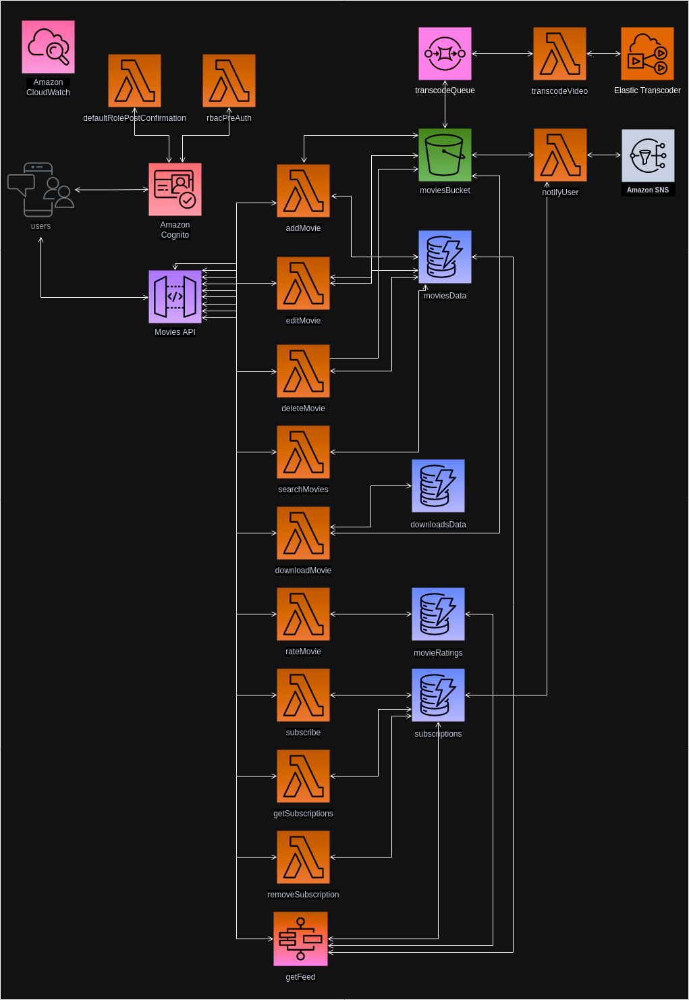

# Movie Content Management System

This repository contains a cloud-native web application designed to store and manage movie content using AWS cloud services. The system follows a cloud-native architecture to ensure scalability, reliability, and performance.

## Table of Contents

- [Introduction](#introduction)
- [User Types](#user-types)
- [System Components](#system-components)
- [Functional Requirements](#functional-requirements)
- [Non-Functional Requirements](#non-functional-requirements)
- [Communication Style](#communication-style)
- [API Gateway](#api-gateway)
- [Frontend Deployment](#frontend-deployment)
- [Notification System](#notification-system)
- [Team members](#Team-members)

## Introduction

The Movie Content Management System allows users to manage and interact with movie content through a client application. It supports various user roles, including administrators and regular users, each with specific functionalities.

## User Types

- **Unauthenticated User**: Can register and log in to the system.
- **Administrator**: Authenticated user with the ability to upload, view, edit, and delete movie content.
- **Regular User**: Authenticated user who can search, view, rate, download, and subscribe to movie content. Regular users also receive notifications for subscribed content and have a personalized feed based on their interactions.

## System Components

- **Client Application**: Provides a graphical interface for users to access system functionalities.
- **Server Application**: Cloud-native application containing the system's business logic. Uses various AWS services to fulfill functional and non-functional requirements.

## Functional Requirements

- **User Registration**: Unauthenticated users can register by providing personal details and a password.
- **User Login**: Registered users can log in using their username and password.
- **Content Management**:
    - **Upload Content**: Administrators can upload movie content along with metadata.
    - **View Content**: Users can view movie content and metadata.
    - **Edit Content**: Administrators can edit movie content and metadata.
    - **Delete Content**: Administrators can delete movie content and associated metadata.
- **Search Content**: Regular users can search for content based on metadata.
- **Download Content**: Regular users can download movie content.
- **Rate Content**: Regular users can rate movie content.
- **Subscribe to Content**: Regular users can subscribe to content based on metadata.
- **Manage Subscriptions**: Regular users can view and delete their subscriptions.
- **Personalized Feed**: Regular users have a personalized feed based on their interactions with the system.
- **Content Transcoding**: The system supports transcoding movie content into different resolutions.

## Non-Functional Requirements

- **Cloud-Native Architecture**: The system uses appropriate AWS services to support a cloud-native architecture.
- **Separate Storage for Content and Metadata**: Content and metadata are stored in appropriate storage solutions.
- **Search Performance**: The system is optimized for search performance.
- **Infrastructure as Code**: All services are instantiated and configured using Infrastructure as Code (IaC) tools.
- **Deployment of Frontend Application**: The frontend application is publicly accessible and interacts with the system.

## Communication Style

The project adheres to event-driven architecture principles, using synchronous and asynchronous communication as appropriate.

## API Gateway

The API Gateway serves as the entry point to the system, offering a REST API for communication between the client and server applications.

## Frontend Deployment

The frontend application is deployed and publicly accessible, allowing user interaction with the system.

## Notification System

Users receive notifications when new content they are subscribed to is uploaded. Notifications include basic information about the content.

## Team members

- Popov Vladimir SV29/2021
- Bulatovic Balsa SV37/2021
- Vidakovic Teodor SV33/2021